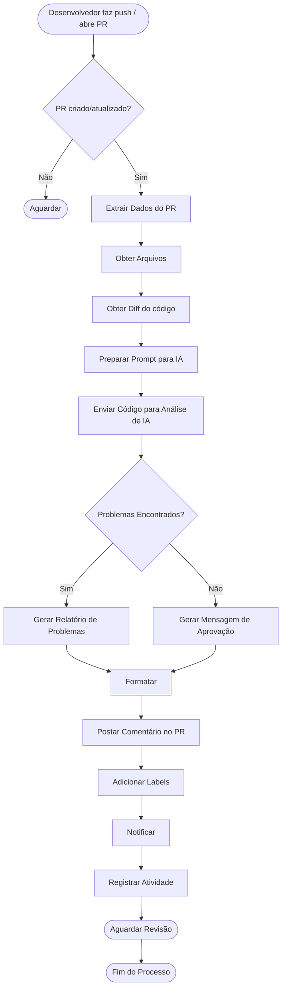
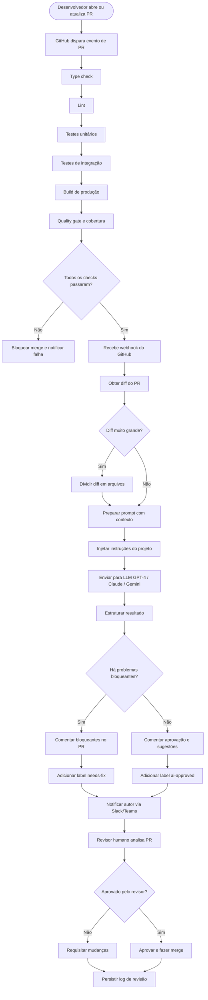
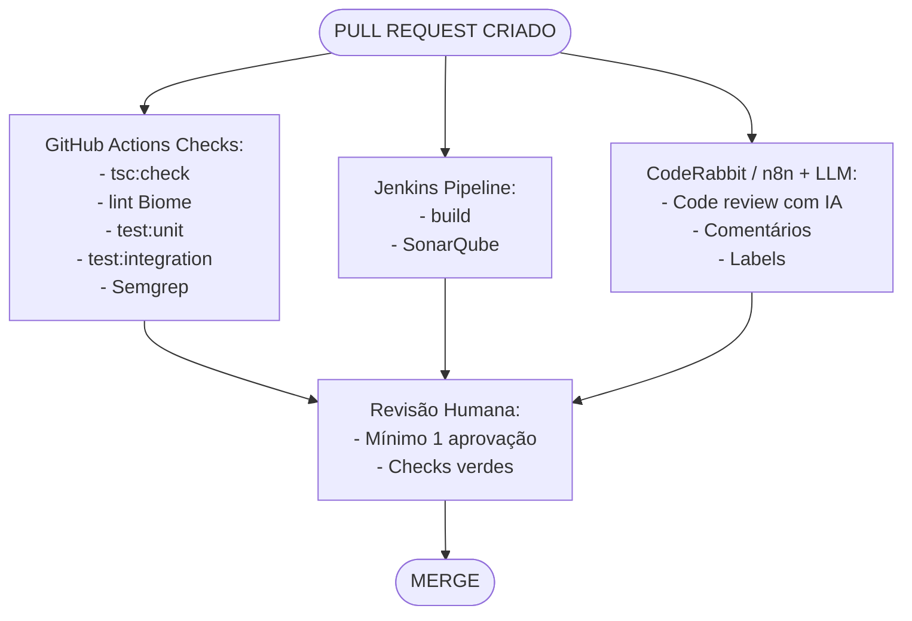

# Code Review com IA e Automações

## Sumário
1. Resumo do Projeto
2. Fluxo Proposto (MVP)
3. Críticas ao Fluxo Inicial
4. Ferramentas Disponíveis para Code Review Automatizado
5. Boas Práticas de CI/CD já Utilizadas no Projeto
6. Fluxo Recomendado (CI/CD + IA)
7. Passo a Passo para Implantação

## 1. Resumo do Projeto
O objetivo é **automatizar o processo de code review** em Pull Requests (PRs) utilizando uma combinação de ferramentas estáticas de análise de código, pipelines de CI/CD e Inteligência Artificial. O gatilho é o evento de criação ou atualização de um PR no GitHub, que dispara um webhook para o **n8n** — plataforma de automação de fluxos. O n8n orquestra a extração do diff do código, o envio para análise por IA e a publicação dos resultados como comentário no PR, além de adicionar labels e notificar o desenvolvedor.

## 2. Fluxo Proposto (MVP)

### Diagrama de Fluxo

### Componentes-chave:
*   **Gatilho:** Webhook do GitHub → n8n
*   **Orquestrador:** n8n (workflow de automação)
*   **Analisador:** LLM via API (OpenAI GPT-4 / Claude / Gemini)
*   **Destino do feedback:** Comentário inline no PR do GitHub

## 3. Críticas ao Fluxo Inicial

O fluxo apresentado é funcional como MVP, mas apresenta pontos de atenção relevantes:

### 3.1 Ausência de Análise Estática Prévia
O fluxo pula diretamente para a IA sem antes executar ferramentas determinísticas (SonarQube, Biome, testes). **Problemas triviais** (formatação, cobertura, falhas de build) seriam desperdiçados como tokens de IA, gerando custo e latência desnecessários.
**Sugestão:** Executar Biome + testes unitários + SonarQube _antes_ de acionar a IA. Somente enviar para IA se o pipeline de CI passar nas verificações básicas.

### 3.2 Prompt sem Contexto Suficiente
Apenas o diff do código não é contexto suficiente para uma análise densa. A IA não conhece a arquitetura do projeto (Clean Architecture, CQRS), as convenções de código ou os padrões de teste adotados.
**Sugestão:** Incluir no prompt as instruction files do projeto (`.github/instructions/src.instructions.md` e `.github/instructions/test.instructions.md`), além de snippets de exemplos já existentes no codebase.

### 3.3 Sem Limite de Tamanho do Diff
Diffs muito grandes (> 400 linhas) ultrapassam janelas de contexto de LLMs menores e geram respostas genéricas ou truncadas.
**Sugestão:** Limitar a análise por IA a arquivos com até N linhas de diff por request. Dividir arquivos grandes em chunks menores.

### 3.4 Sem Mecanismo de Feedback Loop
O fluxo não prevê que o desenvolvedor possa responder ao comentário da IA para refinamento ou que a IA possa reagir a novos commits no mesmo PR.
**Sugestão:** Adicionar um passo que reanalisa o PR a cada novo push, mas apenas nos arquivos modificados desde a última revisão.

### 3.5 Sem Separação entre Severidades
O relatório gera uma saída única sem categorizar problemas por nível de severidade (bloqueante, warning, sugestão).
**Sugestão:** Estruturar o output da IA com categorias: 🔴 Bloqueante, 🟡 Warning, 🔵 Sugestão. Somente severidades bloqueantes devem impedir o merge.

### 3.6 Ponto único de falha no n8n
Se o serviço n8n estiver indisponível, o webhook do GitHub não tem retentativa nativa.
**Sugestão:** Configurar um mecanismo de retry no webhook ou usar uma fila intermediária (ex: SQS, Redis Queue).

### 3.7 Sem Auditoria e Rastreabilidade
O passo "Registrar Atividade" é vago. Sem logs estruturados, é difícil auditar o histórico de revisões feitas pela IA.
**Sugestão:** Persistir em banco de dados (DynamoDB, já usado no projeto) cada revisão com: PR ID, hash do commit, resultado da IA, timestamp e modelo utilizado.

## 4. Ferramentas Disponíveis para Code Review Automatizado

### 4.1 Análise Estática de Código
| Ferramenta | Descrição | Status no Projeto |
| :--- | :--- | :--- |
| **SonarQube** | Análise de qualidade de código, cobertura, duplicações, vulnerabilidades e dívida técnica. | ✅ Já em uso |
| **Biome** | Linter e formatter para TypeScript/JavaScript. | ✅ Já em uso (`biome.json`) |
| **Dependency-Check** | Análise de vulnerabilidades em dependências do `package.json`. | Mencionado em exclusões |
| **CodeClimate** | Similar ao SonarQube. | ❌ Não utilizado |
| **Semgrep** | Análise estática com regras customizáveis de segurança. | ❌ Não utilizado |

### 4.2 Plataformas de CI/CD e Automação
| Ferramenta | Descrição | Status no Projeto |
| :--- | :--- | :--- |
| **Jenkins** | Pipeline CI/CD já configurado via `Jenkinsfile`. | ✅ Já em uso |
| **GitHub Actions** | Workflows nativos do GitHub. | ❌ Não configurado |
| **GitLab CI** | Pipelines nativos do GitLab. | ❌ N/A |
| **CircleCI / TravisCI** | Alternativas em nuvem. | ❌ Não utilizados |

### 4.3 Code Review com IA
| Ferramenta | Descrição | Custo |
| :--- | :--- | :--- |
| **CodeRabbit** | Plataforma dedicada de code review com IA. | Freemium / Pago |
| **GitHub Copilot Code Review** | Recurso do Copilot Enterprise. | Pago |
| **Greptile** | Analisa o codebase inteiro como contexto. | Pago |
| **Cursor AI / Windsurf** | IDEs com IA embutida. | Pago |
| **OpenAI / Anthropic API (custom)** | Solução customizada via n8n. | Pay-per-use |

### 4.4 Automação de Fluxo (No-Code / Low-Code)
| Ferramenta | Descrição |
| :--- | :--- |
| **n8n** | Escolhido no MVP. Suporte a webhooks, self-hosted ou cloud. |
| **Zapier** | Mais simples, menos controle e mais caro. |
| **Make** | Boa integração visual. |
| **AWS Step Functions** | Orquestrador serverless. |

## 5. Boas Práticas de CI/CD já Utilizadas no Projeto

### 5.1 O que já existe
* ✅ Testes Unitários (Vitest) → `npm run test:unit`
* ✅ Testes de Integração (Vitest) → `npm run test:integration`
* ✅ Análise de Qualidade (SonarQube) → Quality Gate "Natura way"
* ✅ Linting e Formatação (Biome) → `npm run lint`
* ✅ Type Check (TypeScript) → `npm run tsc:check`
* ✅ Build de Produção → `npm run build`
* ✅ Pipeline CI (Jenkins) → `Jenkinsfile`
* ✅ Husky (pre-commit hooks) → `npm prepare`

### 5.2 O que poderia ser adicionado
* ❌ GitHub Actions para checks de PR
* ❌ Análise de Segurança (Semgrep)
* ❌ Análise de Dependências (OWASP)
* ❌ Conventional Commits Enforcer
* ❌ Branch Protection Rules
* ❌ Renovate Bot / Dependabot
* ❌ Code Review com IA (CodeRabbit / n8n)

## 6. Fluxo Recomendado (CI/CD + IA)

### Diferenças-chave em relação ao MVP inicial
*   **Validações antes da IA:** Type check, lint, testes, Sonar
*   **Contexto do prompt:** Diff + instruções do projeto
*   **Diffs grandes:** Divisão em chunks por arquivo
*   **Severidade dos problemas:** Bloqueante / Warning / Sugestão
*   **Registro de atividade:** DynamoDB com PR ID, hash, modelo, timestamp
*   **Ponto único de falha n8n:** Retry + fila intermediária

## 7. Passo a Passo para Implantação
*(Consulte o documento original detalhado para ver as etapas técnicas, scripts YAML de CI, docker-compose do n8n e configuração do GitHub)*

### Etapa 7 — Resumo do Stack Final Recomendado

