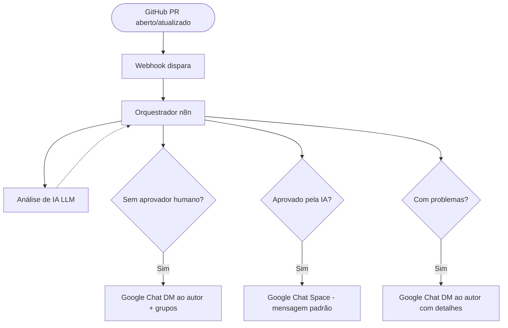
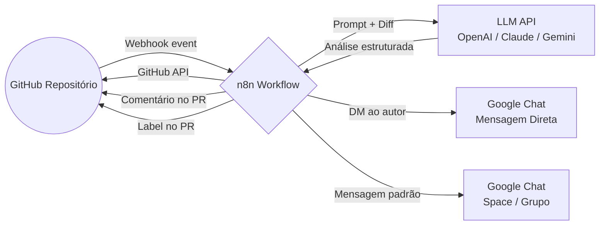
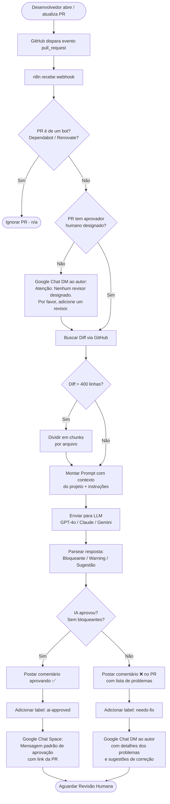

# Guia de Pré-Implementação: Code Review Automatizado com IA

**Objetivo deste documento:** Levantar todas as informações, credenciais, autorizações e configurações necessárias *antes* de começar a implementar a solução. Nada de código ainda — este é o checklist de descoberta e coleta de dados.

## Sumário
* Visão Geral da Solução
* Mapa de Dependências
* Bloco 1 — GitHub
* Bloco 2 — n8n
* Bloco 3 — Google Chat
* Bloco 4 — Serviço de IA (LLM)
* Bloco 5 — Regras de Negócio do Fluxo
* Bloco 6 — Infraestrutura e Segurança
* Checklist Consolidado
* Fluxo Completo com os Novos Requisitos
* Próximos Passos

---

## Visão Geral da Solução

**Componentes envolvidos:**
* **GitHub** → fonte dos eventos e destino dos comentários no PR
* **n8n** → orquestrador central do fluxo
* **LLM API** → análise inteligente do código
* **Google Chat** → canal de comunicação com o time (DMs e spaces/grupos)

---

## Mapa de Dependências

---

## Bloco 1 — GitHub

### 1.1 Informações do Repositório
*   **Nome da organização/owner:** URL do repositório
*   **Nome do repositório:** URL do repositório
*   **Branches protegidas:** `main`, `develop` ou outros (Settings → Branches)
*   **Visibilidade do repositório:** Público ou Privado

### 1.2 Token de Acesso ao GitHub (PAT ou GitHub App)
São necessárias permissões para **ler o diff do PR** e **escrever comentários/labels**.
*   **Opção A: Personal Access Token (PAT):** mais simples (Requer `repo`, `pull_requests: write`, `issues: write`).
*   **Opção B: GitHub App:** recomendado para produção.

### 1.3 Webhook do GitHub
A URL pública do n8n que receberá os eventos (`pull_request`: opened, synchronize, reopened) com o Secret correspondente configurado.

### 1.4 Configurações de Branch Protection
Para garantir que o merge só ocorra após aprovação humana: Exigir PR antes do merge, Número mínimo de aprovações, Dispensar aprovações obsoletas após novos commits, Exigir que status checks passem.

---

## Bloco 2 — n8n

### 2.1 Decisão de Hospedagem
*   **n8n Cloud:** Zero infra, URL pública já disponível. (Custo ~$20-$50/mês).
*   **Self-hosted (Docker/Kubernetes):** Controle total, sem custo de licensing. Requer servidor.

### 2.2 Informações Necessárias para o n8n
Variáveis e credenciais: URL pública do n8n, Credenciais de admin, `N8N_ENCRYPTION_KEY`, Credencial HTTP Header Auth para webhook, Credencial GitHub API, Credencial LLM API, Credencial Google Chat.

---

## Bloco 3 — Google Chat

### 3.1 Entendendo as Modalidades
*   **Mensagem Direta (DM):** API Google Chat com identificação do usuário.
*   **Space (Grupo/Sala):** Webhook do Space ou API Google Chat.

### 3.2 DM ao Autor e 3.3 Mensagem no Space
*   Precisaremos do e-mail do autor da PR (com possível mapeamento do username do GitHub).
*   Necessário uma **Service Account** do GCP para enviar DMs em nome do bot.
*   Para Spaces, recomenda-se um Incoming Webhook simples ou o bot da Service Account.

---

## Bloco 4 — Serviço de IA (LLM)

### 4.1 Escolha do Provedor de LLM
Opções comuns: OpenAI (GPT-4o), Anthropic (Claude 3.5 Sonnet), Google (Gemini 1.5 Pro). O recomendado para o MVP pode ser o Gemini, dado que a integração nativa com Google Cloud/Workspace ajuda as políticas corporativas (já usando Google Chat).

### 4.2 Credenciais e 4.3 Estimativa de Custos
*   API Key e limites estipulados de Tokens.
*   Estimativa de Custo para ~100 PRs/mês e ~15k tokens/PR = ~$15/mês por GPT-4o.

---

## Bloco 5 — Regras de Negócio do Fluxo

Estas decisões precisam ser confirmadas com o time:
*   **5.1 Regra "Sem Aprovador Humano":** Bloquear o merge ou apenas notificar no chat? Designar automaticamente via `CODEOWNERS`?
*   **5.2 Regra "Aprovação pela IA":** O que a mensagem deve conter. A IA NÃO substitui aprovação humana, atua apenas como camada adicional.
*   **5.3 Regra "Problemas Encontrados":** Warnings bloqueiam merge ou apenas problemas Bloqueantes? O re-commit reanalisa apenas arquivos modificados? 
*   **5.4 Regra "PRs Analisadas":** Analisar dependabot/renovate? Analisar todo PR ou PRs menores que N linhas?

---

## Bloco 6 — Infraestrutura e Segurança

*   Gerenciamento seguro de Tokens via n8n Credentials Manager.
*   Não possuir credenciais expostas no código JSON exportado.
*   Checklist de Rede e Firewall (O IP do n8n é acessível pelo GitHub?).
*   Compliance em envio de IPs / Código de terceiros para IA (OpenAI/Anthropic/Gemini).

---

## Fluxo Completo com os Novos Requisitos

---

## Checklist Consolidado & Próximos Passos
Um consolidado e sequenciamento de reuniões e aprovações com as áreas de Segurança da Informação, Infraestrutura, e Time Técnico.
1. Coleta de Informações (este doc)
2. Configuração de Acessos e Contas
3. Infraestrutura n8n
4. Configuração GitHub (branch rules, webhook)
5. Desenvolvimento do Workflow n8n
6. Testes em Staging e Validação
7. Rollout para projeto piloto e iteração no prompt.
